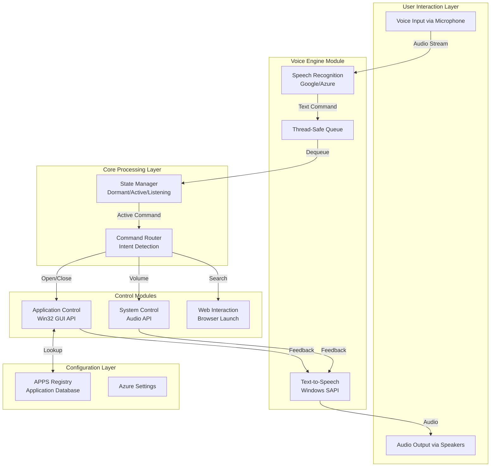
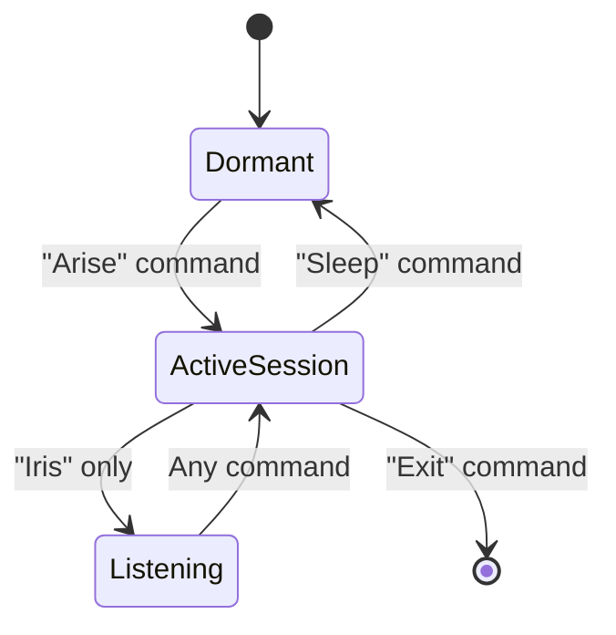
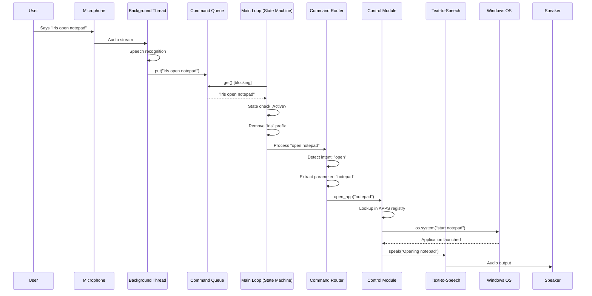
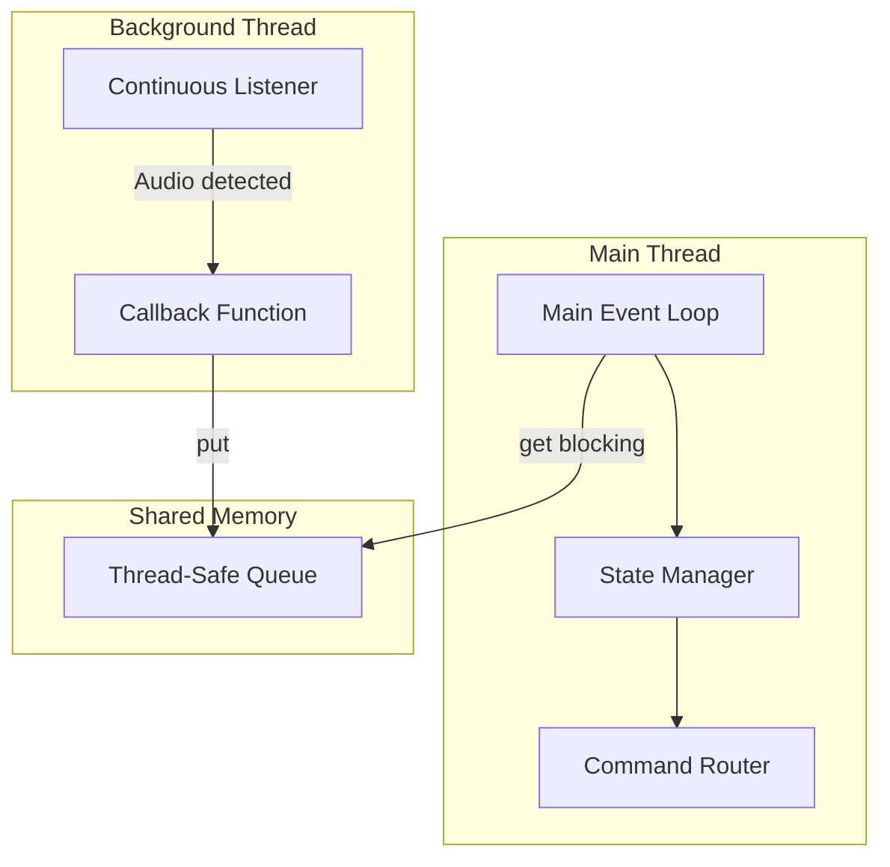

# Windows Voice Assistant - Comprehensive Project Documentation

**Academic Report for Educational Understanding**  
*Project Name:* Windows Voice Assistant  
*Date:* February 13, 2026  
*Repository:* [Sj2252/Windows-Assistant](https://github.com/Sj2252/Windows-Assistant)

---

## Table of Contents

1. [Executive Summary](#executive-summary)
2. [Project Overview](#project-overview)
3. [System Architecture](#system-architecture)
4. [Module Breakdown](#module-breakdown)
5. [Key Principles and Design Patterns](#key-principles-and-design-patterns)
6. [Data Flow and Communication](#data-flow-and-communication)
7. [Technical Implementation Details](#technical-implementation-details)
8. [Dependencies and Technologies](#dependencies-and-technologies)
9. [Future Extensibility](#future-extensibility)
10. [Changelog](#changelog)

---

## Executive Summary

The **Windows Voice Assistant** is a modular, voice-controlled desktop automation system designed for Windows operating systems. The project demonstrates advanced software engineering principles including **modular architecture**, **multi-threading**, **thread-safe inter-process communication**, and **abstraction layers** for system-level operations.

### Core Capabilities
- **Voice Recognition**: Continuous speech-to-text conversion using Google Speech Recognition or Azure Cognitive Services
- **Application Control**: Launch, close, maximize, minimize Windows applications
- **System Control**: Adjust system volume programmatically
- **Web Interaction**: Perform web searches through voice commands
- **State Management**: Intelligent state machine for activation and command processing

### Academic Value
This project exemplifies real-world application of:
- **Design Patterns**: State Machine, Command Pattern, Factory Pattern
- **Concurrency**: Multi-threaded architecture with producer-consumer pattern
- **API Integration**: Windows API, COM Automation, Speech Recognition Services
- **Modular Design**: Separation of concerns across distinct modules

---

## Project Overview

### Problem Statement
Modern desktop workflows require frequent interaction with mouse and keyboard, which can be inefficient for repetitive tasks. This project solves this by providing a **hands-free voice interface** to control Windows applications and system settings.

### Solution Architecture
The solution implements a **layered architecture** with five specialized modules:

1. **Voice Engine** (`voice_engine.py`) - Handles speech recognition and text-to-speech
2. **Central Router** (`main.py`) - Manages state and routes commands
3. **Application Control** (`app_control.py`) - Manages Windows applications
4. **System Control** (`system_control.py`) - Controls system hardware (volume)
5. **Configuration** (`config.py`) - Application registry and settings

---

## System Architecture

### High-Level Architecture Diagram



### Architectural Layers

| Layer | Components | Responsibility |
|-------|-----------|----------------|
| **Presentation** | Voice I/O | User interaction through speech |
| **Application** | State Manager, Router | Business logic and command interpretation |
| **Service** | App Control, System Control, Web Control | Specialized operations |
| **Data** | APPS Registry, Config | Configuration and application database |

---

## Module Breakdown

### 1. Voice Engine (`voice_engine.py`)

#### Purpose
Provides the fundamental I/O capabilities for voice interaction: listening to user commands and speaking responses.

#### Key Components

##### 1.1 Text-to-Speech (TTS) System
**Technology**: Windows SAPI (Speech Application Programming Interface)

```python
windows_speaker = win32com.client.Dispatch("SAPI.SpVoice")

def speak(text):
    """Speak the given text using Windows voice"""
    if windows_speaker:
        windows_speaker.Speak(text)
```

**How It Works**:
- Uses COM (Component Object Model) to interface with Windows Speech API
- Offline capability - no internet required
- Synchronous operation - blocks until speech completes

**Key Principle**: **Abstraction** - The `speak()` function provides a simple interface hiding the complexity of COM automation.

##### 1.2 Speech Recognition System
**Technologies**: Google Speech Recognition API or Azure Cognitive Services

**Implementation Choice**: Dual-mode support through configuration flag
```python
def start_listening():
    if USE_AZURE_SPEECH:
        return start_listening_azure()
    else:
        return start_listening_google()
```

**Google Speech Recognition Mode**:
```python
def start_listening_google():
    r = sr.Recognizer()
    r.energy_threshold = 4000  # Minimum audio energy to consider for recording
    r.dynamic_energy_threshold = True  # Auto-adjust to ambient noise
    r.pause_threshold = 0.8  # Seconds of silence to consider phrase complete
    
    mic = sr.Microphone()
    with mic as source:
        r.adjust_for_ambient_noise(source, duration=0.5)
    
    # Start background thread
    stop_listening = r.listen_in_background(mic, callback_google)
    return stop_listening
```

**Azure Speech Recognition Mode**:
```python
def start_listening_azure():
    speech_config = speechsdk.SpeechConfig(
        subscription=AZURE_SPEECH_KEY, 
        region=AZURE_SERVICE_REGION
    )
    speech_recognizer = speechsdk.SpeechRecognizer(
        speech_config=speech_config, 
        audio_config=audio_config
    )
    
    speech_recognizer.recognized.connect(recognized_cb)
    speech_recognizer.start_continuous_recognition()
    return speech_recognizer
```

**Key Differences**:
| Feature | Google SR | Azure SR |
|---------|-----------|----------|
| Internet | Required | Required |
| Cost | Free (limited) | Pay-per-use |
| Accuracy | Good | Excellent |
| Latency | Medium | Low |
| Setup | Simple | Requires API keys |

##### 1.3 Callback System
**Pattern**: **Observer Pattern** - The speech recognition service calls our callback when events occur.

```python
def callback_google(recognizer, audio):
    try:
        text = recognizer.recognize_google(audio, language='en-US')
        print(f"Detected: {text}")
        command_queue.put(text.lower())  # Thread-safe insertion
    except sr.UnknownValueError:
        pass  # Silence or unclear speech
    except sr.RequestError as e:
        speak("Connection error")
```

**Key Principle**: **Asynchronous Processing** - The callback runs in a background thread, allowing the main program to continue executing.

##### 1.4 Thread-Safe Queue
```python
import queue
command_queue = queue.Queue()  # Thread-safe FIFO queue
```

**Why Thread-Safe Queue?**
- **Problem**: Multiple threads accessing the same data structure can cause race conditions
- **Solution**: Python's `queue.Queue` uses internal locks to ensure thread safety
- **Pattern**: **Producer-Consumer Pattern**
  - **Producer**: Background listening thread (produces commands)
  - **Consumer**: Main event loop (consumes commands)

**Data Flow**:
```
[Background Thread] → callback() → queue.put(command) → [Queue] → main_loop() → queue.get() → [Main Thread]
```

---

### 2. Central Router (`main.py`)

#### Purpose
The "brain" of the assistant - manages system state and routes commands to appropriate handlers.

#### Key Components

##### 2.1 State Machine
**Pattern**: **State Machine Pattern** - The system operates in discrete states with defined transitions.



**State Implementation**:
```python
session_active = False       # Global state: Dormant vs Active
listening_for_command = False # Sub-state: Waiting vs Listening
```

**State Transitions**:

| Current State | Trigger | New State | Response |
|--------------|---------|-----------|----------|
| Dormant | "Arise" | Active Session | "I am ready" |
| Active Session | "Iris" only | Listening | "Listening" |
| Listening | Any command | Active Session | Execute command |
| Active Session | "Sleep" | Dormant | "Going to sleep" |

**Implementation**:
```python
while True:
    command = command_queue.get()  # Blocking call - waits for command
    
    # State 1: Dormant
    if not session_active:
        if "arise" in command:
            session_active = True
            speak("I am ready")
        continue
    
    # State 2: Active Session
    if listening_for_command:
        # Process command immediately
        listening_for_command = False
    elif "iris" in command:
        command = command.replace("iris", "").strip()
        if command:
            # Fall through to processing
        else:
            listening_for_command = True
            speak("Listening")
            continue
    else:
        continue  # Ignore commands without "Iris" prefix
```

**Key Principle**: **Finite State Machine** - Explicitly manages system behavior based on well-defined states, preventing unintended actions.

##### 2.2 Command Router
**Pattern**: **Command Pattern** - Encapsulates requests as command objects.

**Intent Detection Logic**:
```python
# Simple keyword-based intent detection
if "time" in command:
    # Time query
elif "open" in command:
    # Launch application
elif "close" in command or "stop" in command:
    # Close application
elif "maximize" in command or "max" in command:
    # Window control
elif "volume" in command or "sound" in command:
    # System control
elif "search" in command:
    # Web interaction
```

**Command Parsing Examples**:

| Voice Input | Detected Intent | Extracted Parameter | Handler |
|-------------|----------------|---------------------|---------|
| "iris open notepad" | `"open"` | `"notepad"` | `open_app("notepad")` |
| "iris set volume to 50" | `"volume"` | `50` (regex) | `set_volume_percentage(50)` |
| "iris close chrome" | `"close"` | `"chrome"` | `close_app_by_name("chrome")` |
| "iris search python tutorials" | `"search"` | `"python tutorials"` | `search_web("python tutorials")` |

**Parameter Extraction**:
```python
# String replacement for app names
app_name = command.replace("open ", "").strip()

# Regex for numbers
numbers = re.findall(r'\d+', command)
volume_percent = int(numbers[0])
```

**Key Principle**: **Delegation** - The router identifies intent but delegates execution to specialized modules.

---

### 3. Application Control (`app_control.py`)

#### Purpose
Manages Windows applications - launching, controlling windows, and closing processes.

#### Key Components

##### 3.1 Application Launch System
**Challenge**: Different types of Windows applications require different launch mechanisms.

**Solution**: **Factory Pattern** - Select appropriate launch method based on application type.

```python
def open_app(app_name):
    app_config = APPS.get(app_name.lower())
    
    if app_config["type"] == "system":
        return open_system_app(app_config["command"], app_name)
    elif app_config["type"] == "office":
        return open_office_app(app_config["office_app"], app_name)
```

##### 3.1.1 System Application Launch
**Method**: Windows shell commands via `os.system()`

```python
def open_system_app(command, app_name):
    os.system(f"start {command}")
    speak(f"Opening {app_name}")
```

**How It Works**:
- `os.system()` executes a shell command
- `start` is a Windows CMD command that launches programs
- Equivalent to: Press `Win+R`, type "notepad", press Enter

**Examples**:
- `start notepad` → Launches Notepad
- `start chrome` → Launches Google Chrome
- `start calc` → Launches Calculator

##### 3.1.2 Office Application Launch
**Method**: COM (Component Object Model) Automation

```python
def open_office_app(office_app, app_name):
    app = win32com.client.Dispatch("Word.Application")
    app.Visible = True  # Make window visible
    app.Documents.Add()  # Create new document
```

**Why COM Instead of Shell?**
- **Control**: COM provides programmatic control over Office features
- **Reliability**: Ensures proper initialization
- **Automation**: Can manipulate documents, spreadsheets, presentations

**Office COM IDs**:
| Application | COM Program ID |
|------------|---------------|
| Word | `Word.Application` |
| Excel | `Excel.Application` |
| PowerPoint | `PowerPoint.Application` |
| Outlook | `Outlook.Application` |

##### 3.2 Window Control System
**Technology**: Windows API via `win32gui` library

**Concept**: **Window Handle (HWND)**
- Every visible window has a unique identifier (HWND)
- Windows API functions manipulate windows using HWND

##### 3.2.1 Finding Windows
```python
def maximize_window(name):
    # Method 1: Find by exact title
    hwnd = win32gui.FindWindow(None, name)
    
    # Method 2: Find by partial title (fallback)
    if not hwnd:
        def callback(hwnd, windows):
            if win32gui.IsWindowVisible(hwnd):
                title = win32gui.GetWindowText(hwnd)
                if name.lower() in title.lower():
                    windows.append(hwnd)
        
        windows = []
        win32gui.EnumWindows(callback, windows)
        if windows:
            hwnd = windows[0]
```

**Key Principle**: **Graceful Degradation** - Attempt exact match first, fall back to partial match if needed.

##### 3.2.2 Window Manipulation
```python
# Maximize window
win32gui.ShowWindow(hwnd, win32con.SW_MAXIMIZE)

# Minimize window
win32gui.ShowWindow(hwnd, win32con.SW_MINIMIZE)

# Restore window
win32gui.ShowWindow(hwnd, win32con.SW_RESTORE)

# Close window
win32gui.PostMessage(hwnd, 0x0010, 0, 0)  # WM_CLOSE message
```

**Windows API Constants**:
| Constant | Value | Action |
|----------|-------|--------|
| `SW_MAXIMIZE` | 3 | Maximize window |
| `SW_MINIMIZE` | 6 | Minimize window |
| `SW_RESTORE` | 9 | Restore to normal size |
| `WM_CLOSE` | 0x0010 | Close window message |

**Key Principle**: **Low-Level System Integration** - Direct interaction with OS through native APIs.

---

### 4. System Control (`system_control.py`)

#### Purpose
Controls system-level hardware and settings (currently focused on audio control).

#### Volume Control Implementation

**Technology**: `pycaw` (Python Core Audio Windows) library

**Challenge**: Windows Audio API uses scalar values (0.0-1.0), but users think in percentages (0-100).

**Solution**: Conversion layer
```python
def set_volume_percentage(percentage):
    # Validation
    if not 0 <= percentage <= 100:
        speak("Volume must be between 0 and 100 percent")
        return False
    
    # Get audio interface
    devices = AudioUtilities.GetSpeakers()
    volume_interface = devices.EndpointVolume
    
    # Convert percentage to scalar
    volume_level = percentage / 100.0
    
    # Set volume
    volume_interface.SetMasterVolumeLevelScalar(volume_level, None)
    speak(f"Volume set to {percentage} percent")
```

**Audio API Flow**:
```
User Input (50) → Validation → Conversion (0.5) → Windows Audio API → Hardware
```

**Key Principle**: **Adapter Pattern** - Converts the interface (percentage) to match what the system expects (scalar).

---

### 5. Configuration (`config.py`)

#### Purpose
Centralized configuration and application registry.

#### APPS Registry
**Pattern**: **Registry Pattern** - Centralized database of application metadata.

```python
APPS = {
    "notepad": {
        "command": "notepad",
        "window_title": "Notepad",
        "type": "system"
    },
    "excel": {
        "type": "office",
        "office_app": "Excel.Application"
    }
}
```

**Registry Schema**:

| Field | Type | Purpose | Required For |
|-------|------|---------|--------------|
| `type` | string | Launch method selector | All |
| `command` | string | Shell command | System apps |
| `window_title` | string | Window identifier | Window control |
| `office_app` | string | COM Program ID | Office apps |

**Key Principle**: **Separation of Configuration from Code** - Adding new applications doesn't require code changes, only configuration updates.

#### Azure Configuration
```python
AZURE_SPEECH_KEY = "YOUR_KEY_HERE"
AZURE_SERVICE_REGION = "eastus"
USE_AZURE_SPEECH = False
```

**Key Principle**: **Configuration Management** - Sensitive data and feature flags separated from logic.

---

### 6. Web Interaction (`web_interaction.py`)

#### Purpose
Enable web searches and browser-based interactions.

#### Implementation
```python
def search_web(query):
    url = "https://www.google.com/search?q=" + urllib.parse.quote(query)
    win32api.ShellExecute(0, "open", url, None, None, 1)
    speak(f"Searching for {query}")
```

**How It Works**:
1. **URL Encoding**: `urllib.parse.quote()` converts spaces and special characters
   - Input: `"python tutorials"`
   - Output: `"python%20tutorials"`
2. **Shell Execute**: Opens URL in default browser
3. **Feedback**: Confirms action to user

**Key Principle**: **URL Encoding** - Ensures special characters don't break the URL.

---

## Key Principles and Design Patterns

### 1. Modular Architecture
**Principle**: Each module has a single, well-defined responsibility.

| Module | Responsibility | Dependencies |
|--------|---------------|--------------|
| `voice_engine.py` | I/O operations | None |
| `config.py` | Configuration data | None |
| `main.py` | Control flow | All modules |
| `app_control.py` | Application management | `config`, `voice_engine` |
| `system_control.py` | Hardware control | `voice_engine` |
| `web_interaction.py` | Web operations | `voice_engine` |

**Benefit**: Changes to one module minimally impact others.

### 2. Separation of Concerns
**Implementation**:
- **Presentation Logic** (Voice I/O) separated from **Business Logic** (Command Routing)
- **Business Logic** separated from **Data** (APPS Registry)

### 3. Producer-Consumer Pattern
**Implementation**: Background listening thread produces commands, main thread consumes them.

```python
# Producer (Background Thread)
def callback_google(recognizer, audio):
    text = recognizer.recognize_google(audio)
    command_queue.put(text.lower())  # Produce

# Consumer (Main Thread)
while True:
    command = command_queue.get()  # Consume
    process_command(command)
```

**Benefit**: Decouples audio input from command processing, preventing blocking.

### 4. Factory Pattern
**Implementation**: Application launch method selection based on type.

```python
if app_config["type"] == "system":
    open_system_app()
elif app_config["type"] == "office":
    open_office_app()
```

### 5. State Machine Pattern
**Implementation**: Explicit states with defined transitions.

**Benefit**: Predictable behavior, easier debugging, clear flow control.

### 6. Abstraction
**Examples**:
- `speak(text)` abstracts SAPI COM automation
- `open_app(name)` abstracts launch mechanism differences
- `set_volume_percentage(percentage)` abstracts scalar conversion

### 7. Error Handling
**Pattern**: Try-except blocks with graceful degradation and user feedback.

```python
try:
    # Attempt operation
    operation()
except Exception as e:
    # Log error
    print(f"Error: {e}")
    # Inform user
    speak("Error occurred")
    return False
```

---

## Data Flow and Communication

### Complete Command Flow



### Thread Architecture



**Thread Safety**: Only the queue is shared between threads, and it uses internal locks to prevent race conditions.

---

## Technical Implementation Details

### Threading Model

**Background Thread** (Voice Engine):
```python
# SpeechRecognition library creates background thread internally
stop_listening = r.listen_in_background(mic, callback_google)
```

**Main Thread** (Central Router):
```python
while True:
    command = command_queue.get()  # Blocks until data available
    process_command(command)
```

**Key Concept**: `queue.get()` is a **blocking call** - the main thread sleeps until a command is available, consuming zero CPU while waiting.

### State Management

**State Variables**:
```python
session_active = False       # Boolean flag
listening_for_command = False # Boolean flag
```

**State Transition Logic**:
```python
# Transition: Dormant → Active
if not session_active and "arise" in command:
    session_active = True

# Transition: Active → Listening
if session_active and "iris" in command and not command_after_iris:
    listening_for_command = True

# Transition: Active → Dormant
if "sleep" in command:
    session_active = False
    listening_for_command = False
```

### Error Handling Strategy

1. **Try-Except Blocks**: All external API calls wrapped in error handling
2. **User Feedback**: Errors communicated via speech
3. **Logging**: Errors printed to console for debugging
4. **Graceful Degradation**: Fallback mechanisms (e.g., partial window title matching)

### Performance Optimizations

1. **Ambient Noise Calibration**: `adjust_for_ambient_noise()` improves accuracy
2. **Dynamic Energy Threshold**: Auto-adjusts to environment
3. **Pause Threshold**: Optimized at 0.8 seconds for natural speech
4. **Background Processing**: Non-blocking I/O

---

## Dependencies and Technologies

### Python Libraries

| Library | Purpose | Installation |
|---------|---------|--------------|
| `SpeechRecognition` | Google speech recognition | `pip install SpeechRecognition` |
| `pywin32` | Windows API, COM automation | `pip install pywin32` |
| `pycaw` | Windows audio control | `pip install pycaw` |
| `azure-cognitiveservices-speech` | Azure speech recognition (optional) | `pip install azure-cognitiveservices-speech` |

### Windows APIs

| API | Interface | Purpose |
|-----|-----------|---------|
| SAPI | `win32com.client` | Text-to-speech |
| Win32 GUI | `win32gui`, `win32con` | Window manipulation |
| Shell Execute | `win32api` | Launch programs/URLs |
| Core Audio | `pycaw` | Volume control |

### External Services

| Service | Type | Usage |
|---------|------|-------|
| Google Speech Recognition | Cloud API | Speech-to-text (default) |
| Azure Cognitive Services | Cloud API | Speech-to-text (optional) |

---

## Future Extensibility

### Adding New Applications

**Step 1**: Add entry to `APPS` registry in `config.py`
```python
"spotify": {
    "command": "spotify",
    "window_title": "Spotify",
    "type": "system"
}
```

**Step 2**: No code changes required! The system automatically handles it.

### Adding New Commands

**Step 1**: Add intent detection in `main.py`
```python
elif "weather" in command:
    get_weather()
```

**Step 2**: Implement handler function
```python
def get_weather():
    # Implementation
    pass
```

### Adding New Control Modules

**Template**:
```python
# new_module.py
from voice_engine import speak

def new_function(parameter):
    try:
        # Implementation
        speak("Action completed")
        return True
    except Exception as e:
        speak("Error occurred")
        return False
```

**Integration**: Import in `main.py` and add routing logic.

### Potential Extensions

1. **Email Control**: Send/read emails via Outlook COM automation
2. **Calendar Management**: Create/view events
3. **File Operations**: Open/move/delete files
4. **Media Control**: Play/pause/skip music
5. **Screen Control**: Screenshot, screen lock
6. **Network Control**: WiFi on/off, VPN connection
7. **Natural Language Processing**: Replace keyword matching with NLP
8. **Custom Wake Words**: Train custom activation phrases
9. **Multi-Language Support**: Add language detection and multilingual commands

---

## Changelog

### Version 1.0 (Initial Implementation)

**Modules Created**:
- ✅ `main.py` - Central router and state management
- ✅ `voice_engine.py` - Voice I/O system
- ✅ `app_control.py` - Application control layer
- ✅ `system_control.py` - System hardware control
- ✅ `web_interaction.py` - Web interaction
- ✅ `config.py` - Configuration and registry

**Features Implemented**:
- ✅ Continuous speech recognition (Google/Azure)
- ✅ Text-to-speech feedback
- ✅ State machine (Dormant/Active/Listening)
- ✅ Application launch (system and Office apps)
- ✅ Window control (maximize/minimize/restore/close)
- ✅ System volume control
- ✅ Web search functionality

**Design Patterns Applied**:
- ✅ Producer-Consumer pattern for threading
- ✅ State Machine pattern for behavior control
- ✅ Factory pattern for application launching
- ✅ Registry pattern for application database
- ✅ Command pattern for intent routing

---

### Future Changes

*This section will be updated as the project evolves. Any modifications to the codebase will be documented here with:*

- **Date**: When the change was made
- **Module**: Which file(s) were modified
- **Change Description**: What was changed and why
- **Impact**: How it affects the system architecture or user experience

**Template for Future Updates**:
```
#### [Date] - [Feature/Fix Name]
**Modified Files**: `filename.py`
**Changes**:
- Added/Modified/Removed [specific functionality]
- Reason: [explanation]
**Impact**: [how it affects users or system]
```

---

## Conclusion

The Windows Voice Assistant demonstrates professional software engineering practices through:

1. **Modular Design**: Clean separation enabling independent development and testing
2. **Thread Safety**: Proper use of synchronization primitives (Queue)
3. **Abstraction Layers**: Hiding implementation complexity behind simple interfaces
4. **Error Handling**: Graceful degradation with user feedback
5. **Extensibility**: Easy to add new commands and applications
6. **Documentation**: Clear code structure with meaningful names

### Learning Outcomes

Students studying this project will gain practical understanding of:
- Multi-threaded application architecture
- Windows API programming
- COM automation for Office applications
- Speech recognition integration
- State machine implementation
- Design pattern application in real-world scenarios

### Key Takeaways

- **Separation of Concerns**: Each module has a single responsibility
- **Abstraction**: Complex operations hidden behind simple interfaces
- **Concurrency**: Background processing for responsive UX
- **Configuration over Code**: Registry pattern for extensibility
- **Error Resilience**: Comprehensive error handling and user feedback

---

## Appendix: Code Structure Summary

```
Voice_Assistant/
├── modular_assistant/
│   ├── main.py              # Central router & state machine (128 lines)
│   ├── voice_engine.py      # Speech recognition & TTS (103 lines)
│   ├── app_control.py       # Application management (160 lines)
│   ├── system_control.py    # System hardware control (30 lines)
│   ├── web_interaction.py   # Web operations (16 lines)
│   └── config.py            # Configuration & registry (26 lines)
├── README.md                # Project documentation (913 lines)
└── PROJECT_DOCUMENTATION.md # This comprehensive report
```

**Total Implementation**: ~463 lines of Python code
**Documentation**: ~1800+ lines

**Code-to-Documentation Ratio**: High documentation density for educational purposes.

---

**End of Report**

*This documentation was created for academic and educational purposes to facilitate understanding of the Windows Voice Assistant project architecture and implementation.*
