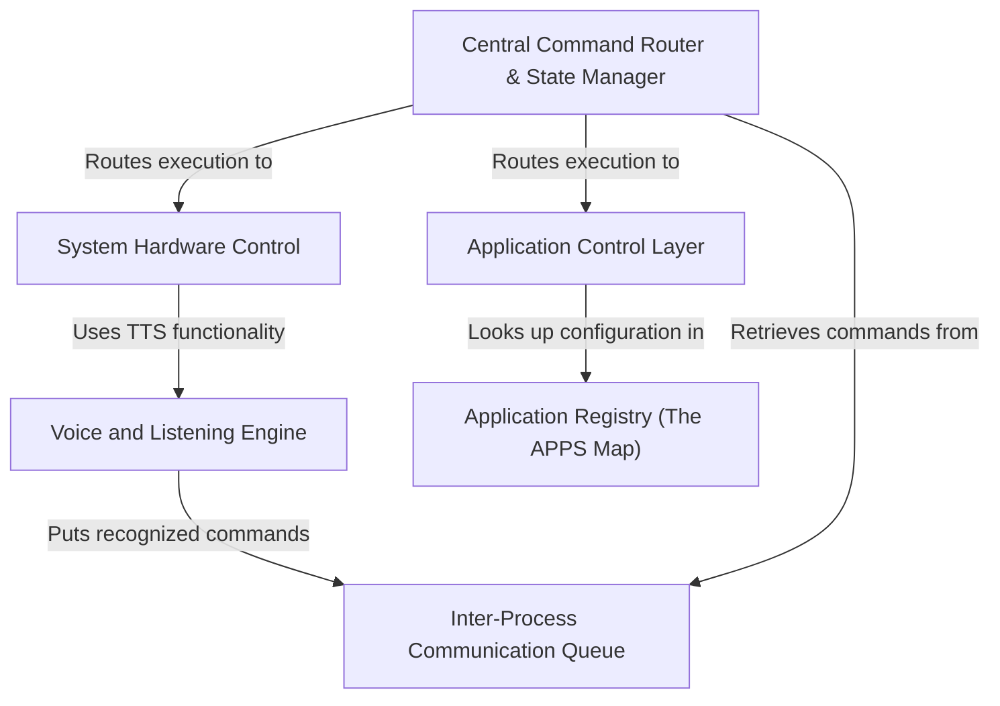
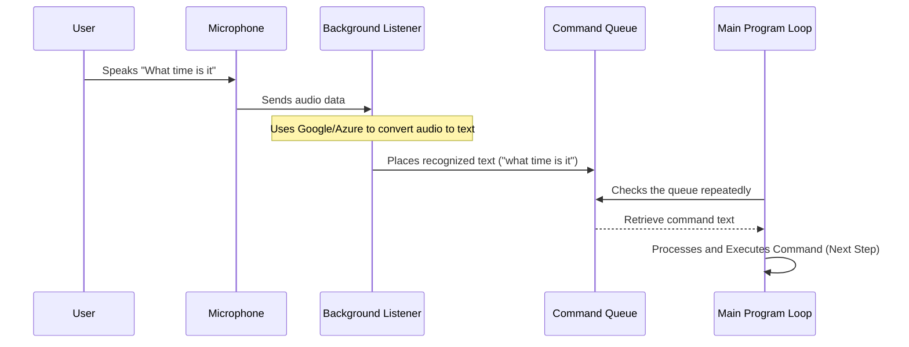
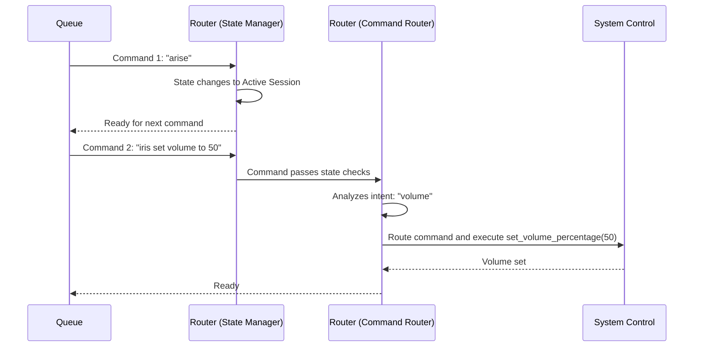
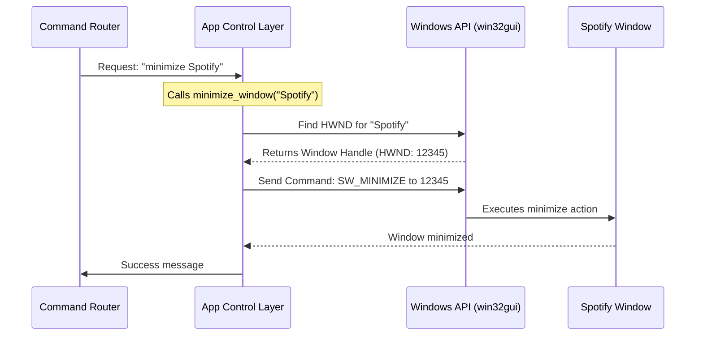
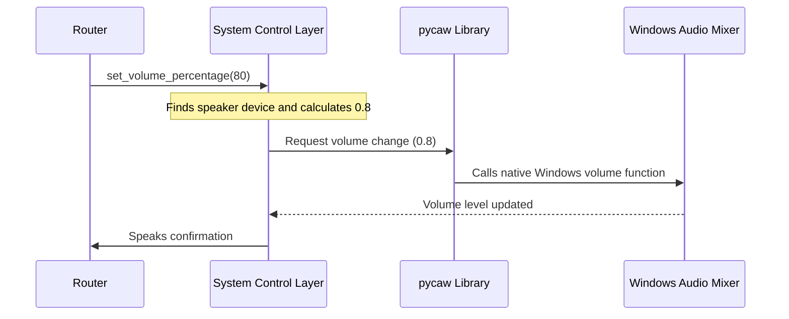
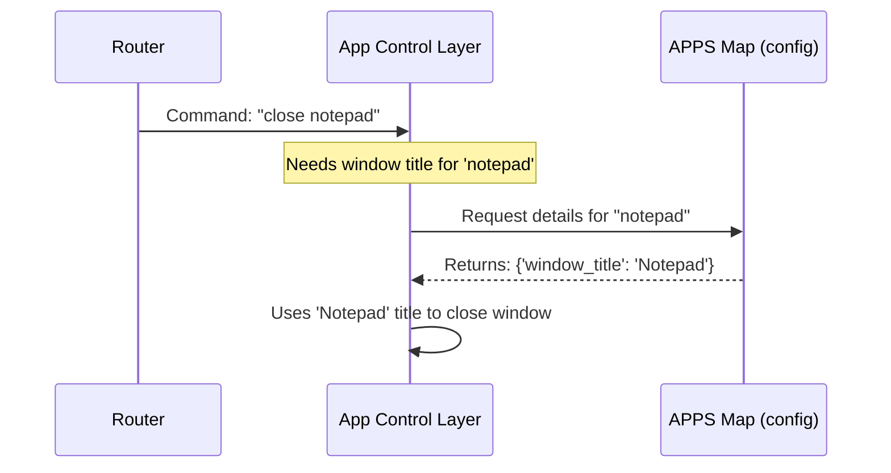
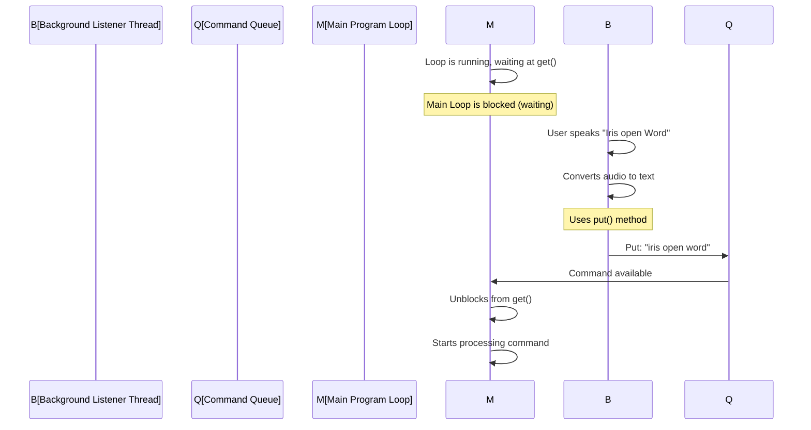

The Windows Assistant is a **voice-controlled application** designed to manage desktop tasks. It relies on the *Voice Engine* (0) to continuously listen and convert spoken words into text commands, which are then passed to the *Central Router* (1) via an asynchronous queue (5). The router analyzes the intent and executes various actions, such as launching and manipulating software windows using the *Application Control Layer* (3) or interacting directly with the operating system, like adjusting the *system volume* (4).


## Visual Overview



## Chapters

1. [Voice and Listening Engine
](# Chapter 1: Voice and Listening Engine
)
2. [Central Command Router & State Manager
](# Chapter 2: Central Command Router & State Manager)
3. [Application Control Layer
](# Chapter 3: Application Control Layer)
4. [System Hardware Control
](# Chapter 4: System Hardware Control)
5. [Application Registry (The APPS Map)
](# Chapter 5: Application Registry (The APPS Map))
6. [Inter-Process Communication Queue
](# Chapter 6: Inter-Process Communication Queue)
---
# Chapter 1: Voice and Listening Engine


### Introduction: Giving the Assistant Ears and a Mouth

Imagine our Windows Assistant is a new apprentice. Before it can perform any actions (like opening a program or checking the time), it needs to master two fundamental skills: listening to your commands and speaking responses back to you.

The **Voice and Listening Engine** is the core component that handles all communication. It acts as the assistant's "ears" (to recognize your voice) and its "mouth" (to speak responses).

**What problem does this engine solve?**

When you build a desktop application, you usually need a main loop that keeps the program running. If we tried to make this main loop constantly check the microphone for sound, the program would become unresponsive—it would "freeze" waiting for you to talk.

The Voice Engine solves this by doing two key things:

1.  **Speech Recognition (SR):** Converting your spoken sound waves into usable text commands.
2.  **Background Processing:** Running the listening process in a separate background thread so the main program stays fast and responsive.

Let's look at how we give the assistant its voice and listening abilities.

---

### Key Concept 1: Text-to-Speech (TTS) - The Mouth

Text-to-Speech (TTS) is how the assistant talks back to you. For the `Windows-Assistant` project, we use the built-in, reliable Windows feature called **SAPI (Speech Application Programming Interface)**. This allows the assistant to speak quickly, even if you are offline.

The engine provides a simple function, `speak(text)`, to handle this:

```python
# File: modular_assistant/voice_engine.py

import win32com.client

# Initialize TTS engine for Windows (Offline)
try:
    windows_speaker = win32com.client.Dispatch("SAPI.SpVoice")
except:
    windows_speaker = None

def speak(text):
    """Speak the given text using Windows voice"""
    if windows_speaker:
        try:
            windows_speaker.Speak(text)
        except Exception as e:
            print(f"Error speaking: {e}")
```

**How to Use:**
When the assistant needs to confirm an action, you simply call this function.

**Input:** `speak("I have opened Spotify")`

**Output:** Your computer instantly speaks the phrase using the default Windows voice.

---

### Key Concept 2: Speech Recognition (SR) - The Ears

To recognize your voice, we rely on high-powered services that convert audio into text. Our engine supports two main options:

1.  **Google Speech Recognition:** Easy to use, suitable for beginners.
2.  **Azure Speech SDK (Microsoft):** Often provides higher accuracy for continuous speech.

The primary function to activate the listening process is `start_listening()`:

```python
# File: modular_assistant/voice_engine.py (Simplified)

def start_listening():
    """Main entry point to start the appropriate background listener"""
    if USE_AZURE_SPEECH:
        # Check configuration settings
        return start_listening_azure()
    else:
        # Default to Google
        return start_listening_google()
```
When this function is called, the assistant's "ears" turn on and begin monitoring the microphone.

---

### Key Concept 3: Background Listening (The Dedicated Thread)

Listening must happen continuously without stopping the rest of the application. We achieve this by running the listening code in a separate **background thread**.

This background listener needs a way to safely send the recognized command text back to the main part of the program. It uses a waiting area called the **`command_queue`** (a queue is like a waiting line where the first item added is the first item taken out).

```python
# File: modular_assistant/voice_engine.py (Simplified)

import queue
# Global queue for commands
command_queue = queue.Queue()

def callback_google(recognizer, audio):
    """Function called by the background thread when a phrase is heard"""
    try:
        # Use Google to convert audio to text
        text = recognizer.recognize_google(audio)
        print(f"Detected: {text}")
        
        # Put the command text into the queue for the Main Program
        command_queue.put(text.lower())
    except sr.UnknownValueError:
        pass # Ignore silence
    # ...
```

Once the background listener finds text, it drops it into the `command_queue`. The main program, which is running smoothly and never freezes, checks this queue constantly to see if there's a new command waiting.

### Step-by-Step Flow: Voice Command

Here is a simplified diagram showing the journey of your voice command through the engine:



The core setup that starts this whole background process using the Google option looks like this:

```python
# File: modular_assistant/voice_engine.py (Start Listening)

def start_listening_google():
    r = sr.Recognizer()
    mic = sr.Microphone()
    
    # 1. Calibrate microphone
    with mic as source:
        r.adjust_for_ambient_noise(source, duration=0.5)
    
    # 2. Start the background thread
    stop_listening = r.listen_in_background(mic, callback_google)
    print("Background listening started...")
    
    return stop_listening
```
The `r.listen_in_background` line is crucial; it tells the library to handle the threading for us and call our `callback_google` function whenever speech is detected.

### Summary

The **Voice and Listening Engine** is the assistant's fundamental connection to the user. It uses external services for robust speech recognition and relies on threading and queuing to ensure that communication is continuous and non-blocking, allowing the rest of the program to run smoothly.

Now that we know how to capture voice commands and turn them into text, we need a structure to interpret that text, manage the assistant's behavior, and decide which action to take.

### Next Steps

This critical job of interpreting commands and managing the state of the assistant is handled by the component we explore next: [Central Command Router & State Manager](02_central_command_router___state_manager_.md).

---
# Chapter 2: Central Command Router & State Manager

In [Chapter 1: Voice and Listening Engine](01_voice_and_listening_engine_.md), we learned how the assistant listens to your voice and converts that audio into text commands, placing them into a waiting area called the `Command Queue`.

Now that we have the text, we need the assistant's **brain**. The Central Command Router & State Manager is this brain. It’s the decision-making unit that reads the queue and determines two critical things:

1.  **When to act:** Is the assistant awake or asleep? (The State Manager)
2.  **What to do:** Which specialized module should handle this specific command? (The Command Router)

## What Problem Does This Component Solve?

Imagine you are constantly talking near your assistant, but only some of the time are you actually giving it an instruction. We need a way to filter out the noise and handle different modes of interaction.

The Router solves this by creating a simple, layered decision structure:

**Use Case:** A command arrives in the queue: `"iris open spotify"`

| Step | Component | Action |
| :--- | :--- | :--- |
| **1.** | State Manager | Checks if the assistant is in the **Active Session** state. (Yes/No?) |
| **2.** | Command Router | Identifies the keyword **"open"**. |
| **3.** | Command Router | Delegates the task to the **[Application Control Layer](03_application_control_layer_.md)** module for execution. |

Without this component, the main program would be a massive, disorganized list of checks that quickly become impossible to manage.

---

## Key Concept 1: The State Manager (When to Act)

The assistant uses a simple "state machine" to control its alertness. This ensures it only processes commands when you specifically activate it.

There are three main states:

| State Name | Status | Activation Keyword(s) | Exit Keyword(s) |
| :--- | :--- | :--- | :--- |
| **1. Dormant** | Asleep; ignores all speech. | **"Arise"** (or "Arice") | |
| **2. Active Session** | Awake; waits for its name before every command. | **"Iris"** (or "Iris open Spotify") | **"Sleep"** (or "Go to sleep") |
| **3. Listening** | (Temporary) Waits for one quick, immediate command after hearing only **"Iris"**. | Just **"Iris"** (no command after it) | Any recognized command |

This system prevents the assistant from misinterpreting a private conversation as a command.

### State Logic in Code

The State Manager uses simple variables (`session_active` and `listening_for_command`) to track which state it is in.

When a command comes in, the first thing the Router does is check the main activation switch:

```python
# File: modular_assistant/main.py (Simplified)

# Global flag to track if we are awake
session_active = False 

while True:
    command = command_queue.get()
    
    # --- State 1: Dormant Check ---
    if not session_active:
        if "arise" in command:
            session_active = True
            speak("I am ready.")
        else:
            # If dormant and not "arise", ignore text and continue loop
            continue
```

If the assistant is active (`session_active = True`), it moves on to check for the **"Iris"** prefix before processing the command.

---

## Key Concept 2: The Command Router (What to Do)

Once the State Manager confirms the assistant should act, the Command Router analyzes the text to determine the user's intent.

The Router works by checking for specific **keywords** (verbs) at the beginning of the command:

*   If the command contains `"open"`, it's routed to the [Application Control Layer](03_application_control_layer_.md).
*   If the command contains `"volume"`, it's routed to the [System Hardware Control](04_system_hardware_control_.md).
*   If the command contains `"search"`, it's routed to the web interaction module.

This pattern is known as **delegation**—the Router handles the *decision*, but delegates the *work* to the specialized modules.

### Routing Logic in Code

The main loop processes the command using simple `if/elif` statements.

```python
# File: modular_assistant/main.py (Routing)

# Assume the command has passed the "Iris" check
# Example command: "open notepad"

if "time" in command:
    # 1. Intent: Simple Query
    time_str = datetime.datetime.now().strftime("%H:%M")
    speak(f"The time is {time_str}")

elif "open" in command:
    # 2. Intent: Application Control
    app_name = command.replace("open ", "").strip()
    open_app(app_name) # Hand off to Application Control

elif "volume" in command:
    # 3. Intent: System Control
    # Extract the number (e.g., 50)
    numbers = re.findall(r'\d+', command) 
    set_volume_percentage(int(numbers[0])) # Hand off to System Control
```

---

## The Command Journey Through the Router

Let’s visualize how the entire process looks when you say, "Arise. Iris set volume to 50."



This journey shows how the State Manager handles the initial wakeup call ("Arise") and then the Command Router takes over for all subsequent tasks by analyzing keywords and passing the job to the correct specialist, like the [System Hardware Control](04_system_hardware_control_.md).

## Summary and Next Steps

The **Central Command Router & State Manager** is the control room of the `Windows-Assistant`. It gives the assistant the crucial ability to manage its alertness and correctly interpret user intent by routing commands to the right internal module.

We now understand how commands are captured and how they are interpreted. In the next chapter, we will look inside the first major specialized module: the system that handles starting, stopping, and managing desktop windows.

---
# Chapter 3: Application Control Layer

In the previous chapters, we gave the assistant ears and a mouth ([Voice and Listening Engine](01_voice_and_listening_engine_.md)), and we built its brain to interpret commands and decide what to do ([Central Command Router & State Manager](02_central_command_router___state_manager_.md)).

Now, the assistant has received a command like `"Iris open calculator"` or `"Iris close Spotify"`. It knows *what* the user wants, but it needs the physical ability to touch and interact with the software running on the desktop.

The **Application Control Layer** is the assistant's set of specialized "hands" and "eyes." It is the module dedicated to starting programs, and finding, moving, resizing, and closing their windows.

## What Problem Does This Component Solve?

Interacting with programs on Windows is complex because not all programs are created equal.

1.  **System Apps** (like Calculator or Notepad) open easily with simple system commands.
2.  **Office Apps** (like Word or Excel) are large and complex, requiring a special language (COM Automation) to start them correctly.
3.  **Window Control** (Maximize, Minimize) requires finding the application's unique ID on the screen.

The Application Control Layer bundles these different methods into simple, universal functions (like `open_app("Word")` or `maximize_window("Chrome")`), so the [Command Router](#) doesn't have to worry about the underlying complexity.

---

## Key Concept 1: Launching Applications (Two Methods)

We need two different approaches depending on the type of application we are launching.

### Method A: Simple System Applications

For most standard Windows programs or programs added to your path (like Chrome, Notepad, or Calculator), we can use simple built-in Python tools that execute Windows commands.

We use the standard `os.system` function, which is like typing a command directly into the Run box (`Win + R`).

```python
# File: modular_assistant/app_control.py (Simplified Launch)
import os

def open_system_app(command, app_name):
    """Opens a simple system application."""
    try:
        # Example: 'start chrome'
        os.system(f"start {command}") 
        speak(f"Opening {app_name}")
        return True
    except Exception as e:
        # Handle errors
        return False
```

### Method B: Microsoft Office Applications (Using COM)

Microsoft Office apps (Word, Excel) are designed to be controlled by other programs. This control mechanism is called **COM (Component Object Model)**. Instead of just launching the program file, we use a special library (`win32com.client`) to connect to the Office program's internal settings.

This is necessary because launching a raw `.exe` might not give us the full control we need, especially for ensuring the program opens a new document and is visible.

```python
# File: modular_assistant/app_control.py (Office Launch)
import win32com.client

def open_office_app(prog_id, app_name):
    """Connects to and opens an Office application."""
    try:
        # prog_id for Word is "Word.Application"
        app = win32com.client.Dispatch(prog_id)
        app.Visible = True # Make sure the window appears!
        app.Documents.Add() # Open a new document
        speak(f"Opening {app_name}")
        return True
    except Exception as e:
        return False
```
***Note:** The assistant uses the [Application Registry (The APPS Map)](05_application_registry__the_apps_map__.md) to know which method (System or Office/COM) to use for each application.*

---

## Key Concept 2: Controlling Windows (`win32gui`)

Once an application is running, we often need to change its position, maximize it, or close it. This requires advanced interaction with the Windows Operating System itself. We use the **Windows API** via the Python library `win32gui`.

### The Window Handle (HWND)

Every open window on your screen has a unique identifier, like a fingerprint, called a **Window Handle (HWND)**. To control a window, we first need to find its HWND based on its title (e.g., "Calculator" or "Untitled - Notepad").

### Maximizing a Window

To maximize a window, the process is:

1.  Use `win32gui.FindWindow` to locate the HWND based on the window's title.
2.  Use `win32gui.ShowWindow` and pass a special constant (`SW_MAXIMIZE`) to tell Windows what action to perform on that specific HWND.

```python
# File: modular_assistant/app_control.py (Window Control)
import win32gui
import win32con # Contains constants like SW_MAXIMIZE

def maximize_window(name):
    """Finds a window by title and maximizes it."""
    # Step 1: Find the HWND (Handle)
    hwnd = win32gui.FindWindow(None, name) 
    
    if hwnd:
        # Step 2: Send the MAXIMIZE command
        # SW_MAXIMIZE is a constant that means "Maximize this window"
        win32gui.ShowWindow(hwnd, win32con.SW_MAXIMIZE)
        return True
    else:
        speak(f"Could not find window {name}")
        return False
```

### Closing a Window

Closing is similar, but instead of using `ShowWindow`, we send a message directly to the window process telling it to close itself. This message is called `WM_CLOSE` (represented by the number `0x0010`).

```python
# File: modular_assistant/app_control.py (Closing)

def close_app_window(window_title):
    """Closes an application by sending the WM_CLOSE message."""
    hwnd = win32gui.FindWindow(None, window_title)
    
    if hwnd:
        # 0x0010 is the Windows message for 'close'
        win32gui.PostMessage(hwnd, 0x0010, 0, 0) 
        return True
    return False
```

---

## The Application Control Workflow

Let's see how a command like **"Iris minimize Spotify"** travels through the system and is executed by the Application Control Layer.



This structure is crucial because it ensures the complex, operating-system-level interactions are kept separate and tidy within the **Application Control Layer**, making the rest of the assistant easy to read.

## Summary and Next Steps

The **Application Control Layer** provides the critical interface for the assistant to manage the software environment. It handles different application types (system apps vs. Office apps) and uses the powerful Windows API to perform physical window manipulations like maximizing, minimizing, and closing programs based on their window titles.

Now that we can control desktop programs, what about the actual computer hardware—like setting the speaker volume or changing screen brightness? That job belongs to the next specialized module.

---
# Chapter 4: System Hardware Control

In the previous chapters, we equipped the assistant with the ability to listen ([Voice and Listening Engine](01_voice_and_listening_engine_.md)), think ([Central Command Router & State Manager](02_central_command_router___state_manager_.md)), and interact with specific applications ([Application Control Layer](03_application_control_layer_.md)).

But what happens when the user asks for something that doesn't involve a specific program? For instance, they might say: **"Iris set volume to 65."**

This command doesn't affect Spotify or Chrome; it affects the core **Windows operating system's master volume**. This type of interaction is handled by the specialized **System Hardware Control** layer.

## What Problem Does This Component Solve?

Interacting with fundamental operating system functions (like audio, network, or power settings) requires talking to Windows at a very low level. This is often complex and involves using libraries specifically designed for Windows API calls.

**The System Hardware Control layer solves this by:**

1.  **Encapsulating Complexity:** Hiding the difficult Windows API calls inside simple Python functions.
2.  **Focusing on System Functions:** Providing a dedicated space for non-application-specific tasks.

Currently, the primary function of this module is highly effective **system volume management**.

---

## Key Concept 1: The Translator (`pycaw`)

To control the Windows volume, we need a special tool to translate our Python commands into instructions Windows can understand. This tool is the **`pycaw`** library.

`pycaw` (Python Core Audio Windows) connects our application directly to the Windows Audio Mixer API. This means we can change the master system volume level, not just the volume within one application.

### Windows Volume Scale

When we say "set volume to 50," we mean 50 percent. However, the Windows Audio API does not use percentages (0-100). Instead, it uses a **scalar value** ranging from **0.0 (silent)** to **1.0 (maximum)**.

The System Control Layer’s job is to handle this conversion automatically:

| User Input (Percentage) | Internal System Value (Scalar) |
| :---: | :---: |
| 100% | 1.0 |
| 50% | 0.5 |
| 5% | 0.05 |

---

## Key Concept 2: Setting the Master Volume

The central function in this layer is `set_volume_percentage(percentage)`. Let's see how it uses `pycaw` to achieve the desired result.

### Step 1: Finding the Speaker Device

First, we must identify the default audio device (your speakers or headphones) that Windows is currently using. We use the `AudioUtilities.GetSpeakers()` function for this:

```python
# Part of modular_assistant/system_control.py
from pycaw.pycaw import AudioUtilities

def set_volume_percentage(percentage):
    # Check if the percentage is valid (0 to 100)
    if not 0 <= percentage <= 100:
        speak("Volume must be between 0 and 100 percent")
        return
        
    # Get the default speaker device
    devices = AudioUtilities.GetSpeakers()
    # Get the interface that controls the volume level
    volume_interface = devices.EndpointVolume
    
    # ... rest of the code
```

### Step 2: Converting and Setting the Volume

Once we have the control interface (`volume_interface`), we convert the user's input percentage into the necessary scalar value (0.0 to 1.0) and send the command.

```python
# Continuation of system_control.py
    
    # Convert percentage (e.g., 65) to decimal scalar (0.65)
    volume_level = percentage / 100.0
    
    # Set the volume using the scalar value
    # The 'None' argument handles session context, which we ignore here.
    volume_interface.SetMasterVolumeLevelScalar(volume_level, None)
    
    speak(f"Volume set to {percentage} percent")
```

**Example Input/Output:**

| Function Call | System Action | Assistant Response |
| :--- | :--- | :--- |
| `set_volume_percentage(30)` | Master volume instantly moves to 30% | "Volume set to 30 percent" |
| `set_volume_percentage(105)` | Fails the initial check | "Volume must be between 0 and 100 percent" |

---

## The System Control Workflow

Let's trace the journey of the command **"Iris set volume to 80"** as it is handled by the specialized layers.



This sequence demonstrates the power of abstraction: the [Central Command Router & State Manager](02_central_command_router___state_manager_.md) only needs to know the user wants volume at 80. The **System Hardware Control** layer handles all the complex, low-level mathematics and interaction with the operating system behind the scenes.

## Summary and Next Steps

The **System Hardware Control** layer is the module responsible for interacting directly with the computer's core operating system functions, currently focusing on volume control via the `pycaw` library. By isolating this low-level interaction, we keep the rest of the assistant clean and focused on interpreting user intent.

We have now covered how to listen, how to think, how to control applications, and how to control the system itself. But how does the assistant quickly look up the exact launch command for "Spotify" or "Word"? It needs a central address book.
.
---
# Chapter 5: Application Registry (The APPS Map)

In the previous chapters, we learned how the assistant interprets user intent ([Central Command Router & State Manager](02_central_command_router___state_manager_.md)) and knows *how* to launch an application using complex functions ([Application Control Layer](03_application_control_layer_.md)).

But when you say, `"Iris open Word"`, how does the assistant know the specific technical launch code for Microsoft Word? It doesn't guess; it uses a cheat sheet.

The **Application Registry**, often referred to as the **APPS Map**, is this essential cheat sheet. It is the application's central phonebook or blueprint that translates the simple name you speak ("Excel") into the precise technical details the computer needs to execute the command.

## What Problem Does This Component Solve?

If the [Application Control Layer](03_application_control_layer_.md) had to store the specific launch command for every application inside its own functions, the code would be long, messy, and hard to update.

The APPS Map solves this problem by providing a single, external configuration dictionary that answers three critical questions for any application:

1.  **What is the user's spoken name for it?** (The key in the map, e.g., `"excel"`).
2.  **How do I start it?** (The launch command or COM ID).
3.  **How do I control it?** (The exact window title Windows uses to identify the running program).

This separation of configuration (the map) from execution (the [Application Control Layer](03_application_control_layer_.md)) makes the assistant clean and easy to customize.

---

## Key Concept 1: The Dictionary Structure

The APPS Map is a simple Python dictionary defined in the `config.py` file. Each entry (key-value pair) holds all the necessary launch data for one program.

The key is the name you might speak, and the value is a nested dictionary of technical properties.

```python
# File: modular_assistant/config.py (Simplified APPS Map)

APPS = {
    # Key: What the user says
    "notepad": {
        "command": "notepad", 
        "window_title": "Notepad", 
        "type": "system"
    },
    "excel": {
        "type": "office", 
        "office_app": "Excel.Application"
    },
    # ... more applications ...
}
```

When the command router gets the text `"open notepad"`, it looks up `"notepad"` in this map to retrieve the details before proceeding.

---

## Key Concept 2: Different Blueprints for Different Apps

As discussed in [Chapter 3: Application Control Layer](03_application_control_layer_.md), we launch system applications differently than we launch Microsoft Office applications. The APPS Map holds the specific blueprint for each type.

| Property | System App (e.g., Notepad) | Office App (e.g., Word) | Purpose |
| :--- | :--- | :--- | :--- |
| **`type`** | `"system"` | `"office"` | Tells the control layer which launch method to use. |
| **`command`** | `"notepad"` | *(Not needed)* | The simple command used by `os.system` to launch the app. |
| **`window_title`** | `"Notepad"` | *(Optional)* | The exact title used by `win32gui` to find/control the window (maximize/close). |
| **`office_app`** | *(Not needed)* | `"Word.Application"` | The special COM ID needed by the `win32com` library to automate the Office app. |

By having both types of entries defined, the assistant can seamlessly handle all major Windows software.

**Example Lookups:**

If the user says `"open chrome"`, the map returns the key for a system launch:

```python
# Details for Chrome
details_chrome = APPS.get("chrome")

# Output of details_chrome: 
# {'command': 'chrome', 'window_title': 'Google Chrome', 'type': 'system'}
```

If the user says `"open powerpoint"`, the map returns the key for a COM launch:

```python
# Details for PowerPoint
details_ppt = APPS.get("powerpoint")

# Output of details_ppt: 
# {'type': 'office', 'office_app': 'PowerPoint.Application'}
```

---

## The Application Registry Workflow

The APPS Map sits between the high-level intent (the spoken name) and the low-level execution (the actual system command).

Let's trace the journey when the user says, **"Iris close notepad"**:



### Implementing the Lookup

The [Application Control Layer](03_application_control_layer_.md) uses a simple lookup function to retrieve this crucial data before it attempts any launch or window control:

```python
# File: modular_assistant/app_control.py (Simplified)

from modular_assistant.config import APPS
from modular_assistant.voice_engine import speak 
# Note: voice_engine imports the speak function

def open_app(app_name):
    """Finds the details and routes the launch."""
    
    # 1. Look up the name in the registry
    details = APPS.get(app_name.lower())
    
    if details is None:
        speak(f"Sorry, I don't know how to open {app_name}.")
        return

    # 2. Use the 'type' field to decide the launch method
    if details['type'] == 'system':
        # Hand off to simple launch function
        # launch_command = details['command']
        # open_system_app(launch_command, app_name)
        pass # Implementation handled in Chapter 3
    
    elif details['type'] == 'office':
        # Hand off to COM launch function
        # open_office_app(details['office_app'], app_name)
        pass # Implementation handled in Chapter 3
```

This structure guarantees that the assistant never tries to launch an app without first verifying all the necessary technical parameters from the central APPS Map.

## Summary and Next Steps

The **Application Registry (The APPS Map)** is the essential configuration file that defines the assistant’s knowledge base about running applications. By storing user-friendly names alongside technical launch commands and window titles, it simplifies the job of the [Application Control Layer](03_application_control_layer_.md) and makes the entire system modular and easy to extend. If you install a new program, you only need to update this dictionary to teach the assistant how to use it!

We have now covered every part of the assistant that takes user input and executes a command. But what happens when the main program needs to communicate with the background processes—like the voice listener—safely?

That communication mechanism is the focus of our final core component.

---
# Chapter 6: Inter-Process Communication Queue

In previous chapters, we built the entire structure of the `Windows-Assistant`: from interpreting commands ([Central Command Router & State Manager](02_central_command_router___state_manager_.md)) to controlling applications ([Application Control Layer](03_application_control_layer_.md)) using specialized data ([Application Registry (The APPS Map)](05_application_registry__the_apps_map__.md)).

However, all these powerful components rely on one simple but vital tool to exchange data safely: the **Inter-Process Communication Queue**.

This queue is the invisible, essential bridge between the assistant's ears (the background listening process) and its brain (the main control loop).

## What Problem Does This Component Solve?

Recall from [Chapter 1: Voice and Listening Engine](01_voice_and_listening_engine_.md) that listening to the microphone is a **background task**. It runs in a separate, parallel stream called a **thread**, so the main part of the program never freezes while waiting for you to speak.

We have two parts of our program running at the same time:

1.  **The Background Listener:** Constantly checking the microphone and converting speech to text.
2.  **The Main Loop:** Constantly checking for commands and executing actions.

If these two parallel processes try to modify the same variable (like a simple text string that holds the latest command) at the *exact same instant*, the data can become garbled or corrupted. This dangerous scenario is called a **Race Condition**.

The **Inter-Process Communication Queue** solves this by acting as a secure drop box. It guarantees that the data placed in it is retrieved intact, in the correct order, and only when the main program is ready.

---

## Key Concept 1: The Queue as a Safe Buffer

In computer science, a queue is simply a waiting line. It enforces the **FIFO** principle: **First-In, First-Out**. The first command recognized by the listener is the first command processed by the main loop.

For our project, we use Python's built-in `queue.Queue`. This specific type of queue is **thread-safe**, meaning it has internal mechanisms (like hidden "locks") that prevent race conditions.

| Function | Action | Used By | Description |
| :--- | :--- | :--- | :--- |
| `put(item)` | Add to the queue | Background Listener | Safely drops the recognized command text into the waiting line. |
| `get()` | Retrieve from the queue | Main Program Loop | Safely pulls the oldest waiting command text out of the line. |

---

## Key Concept 2: The Listener Puts Commands In

The listening process, which lives in `modular_assistant/voice_engine.py`, is responsible for taking the recognized text and submitting it to the queue using the `put()` method.

```python
# File: modular_assistant/voice_engine.py (Simplified)

import queue
# This queue object is shared globally
command_queue = queue.Queue()

def callback_google(recognizer, audio):
    """Function called by the background thread when a phrase is heard"""
    try:
        # Recognized text command
        text = recognizer.recognize_google(audio)
        
        # This is the crucial step: Pushing data safely
        command_queue.put(text.lower())
        print(f"Command put into queue: {text}")
        
    except sr.UnknownValueError:
        pass 
```
The background thread doesn't care if the main program is busy; it just safely drops the command and goes back to listening.

---

## Key Concept 3: The Main Loop Gets Commands Out (Blocking)

The main control loop, which lives in `modular_assistant/main.py`, is responsible for retrieving commands from the queue using the `get()` method.

The `get()` method is special because it **blocks**. This means the main program will literally stop and wait right at that line of code until a new command arrives in the queue.

This blocking behavior is exactly what we want: the brain shouldn't try to think about a command that hasn't been spoken yet.

```python
# File: modular_assistant/main.py (Simplified)
from voice_engine import command_queue

def main():
    # ... setup code ...
    
    # Main loop runs forever
    while True:
        try:
            # The program stops and waits here until the queue has data.
            command = command_queue.get() 
            
            # Once retrieved, the command is processed safely
            if "arise" in command:
                # Start state logic...
                pass
            
            # ... routing logic continues
            
        except KeyboardInterrupt:
            break
```

---

## The Safe Communication Workflow

The entire purpose of the queue is to mediate the handoff between two parallel, asynchronous processes.

Let's visualize the safe journey of a command from the microphone to the command router:



This ensures that the main loop never tries to process a command that is only half-written, and the listener never worries about conflicting with the main loop.

## Summary

The **Inter-Process Communication Queue** is the unsung hero of the `Windows-Assistant` structure. It allows the continuous, asynchronous **Background Listener** to run without interruption while guaranteeing that the **Main Control Loop** receives commands safely, sequentially, and only when they are fully ready.

By mastering the concepts covered in these chapters—from voice recognition and safe queuing to command routing and specialized application control—you now have a full understanding of the robust and modular architecture of the `Windows-Assistant` project!

---
